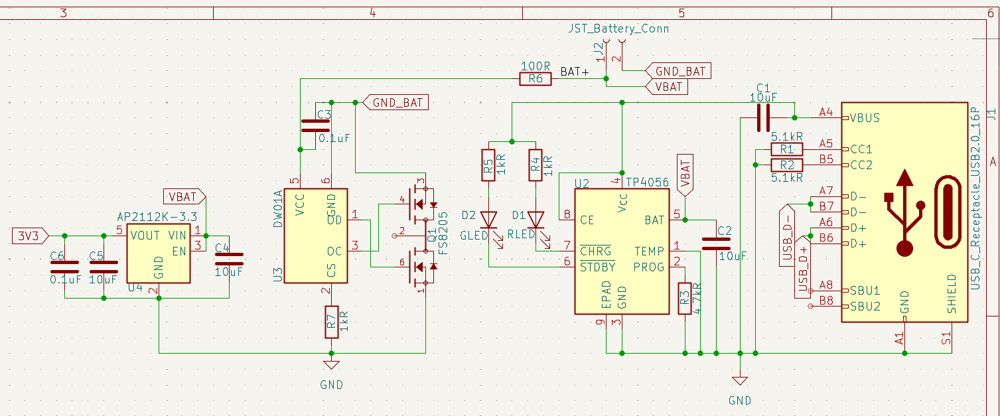
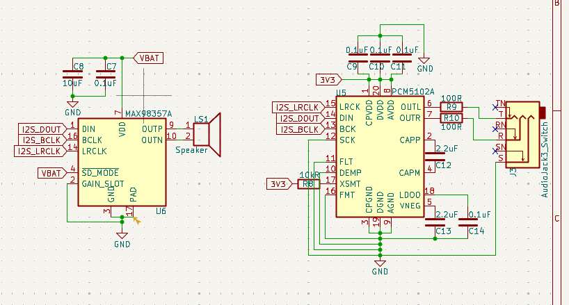
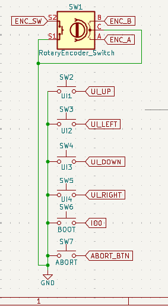
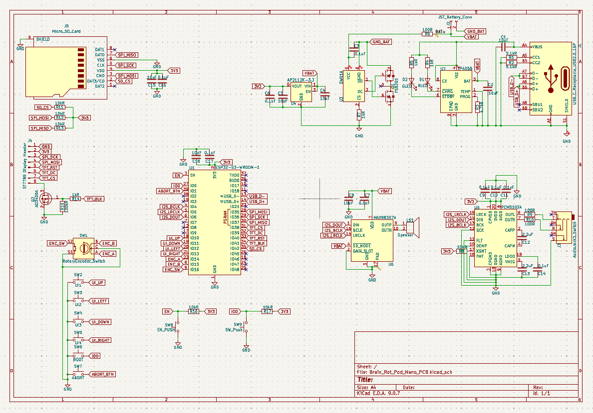
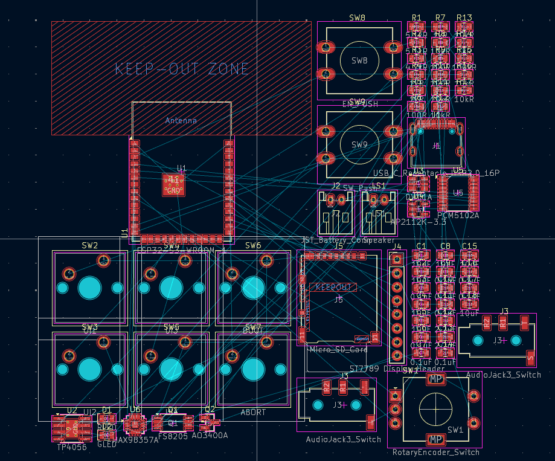

# 3rd August: Setting up Brain_Rot_Pod_Nano!
SO GUYZ this is my very first journal entry for BrainRot_Pod_Nano and i am really excited to work on this project also i might someplaces accidentally refer to BrainRot_Pod_Nano as ShitPod_Nano both mean the same thing so yeah don't get confused 

Anyways so first of all today i created a github repository for BrainRot_Pod_Nano and then i added a very brief description to it 

then i went on to connect this project with Hackatime to tract the coding time and the time spent on journals and Readme more importantly i synced my hackatime and lapse so that my total wok is properly synced 

Then i listed all the Main components i will need for making this project in the readme one thing i would like to clearly state that i use gemini for helping me on this project in what way? let me explain it researches the best parts and suggests me the best ones then i go ahead to research on that specific recommended part making my own decision if i shall use this one or any different part i read the datasheet and see the Typical application circuit to judge for the part selection 

then i also stated why did i use that specific part in the readme 

after writing all the readme stuff i started to place all the components on the schematic sheet i placed the power system first then the audio system and then MCU in the center of the sheet and then i added the storage and display part on the top left of the sheet and then lastly i added all the switches where they were needed to be placed and then i took gemini's ADVICE on where to keep the components and then how to add them so that it causes the lest problem in tomorrow's schematic and also as we are overengineering this we are trying to perfect every single aspect of this Schematic 

Here is today's work 

**Total time spent ~2.5 hours (including lapse and journal)**

# 4th August: Started and finished PCB Schematics! 

SSOOOO guysss today i started the pcb schematics for BrainRot Pod Nano and i am really excited to overenginner every part 
so first of all i started by wiring up the Power Subsystem and adding passive SMD components required fot it 
then i started to wire the subsystem and wired and organized everything as cleanely as i possibly could 
so first of all we started by connection the 5.1kR resistors on the CC1 and CC2 of the USB-c connector....by doing this it tells the Charger to provide 5V to the USB port

then i went over and added decoupling capacitors at the input and output of every IC to stablize power then i added a 4.7kR pull down resistor to the PROG pin of the TP4056 to set the charging current to 250mAh 
and finally added LEDs and also wired up the short circuit protection circuit  

overall i expect the power system to wqork flawlessly because i also rechecked every connection using gemini and it also seems to call the system perfect and it should work even with voltage fluctuations and noise 

Next up i will move on to the audio DAC and amplification circuitry for the speaker connection and the AUX port connections 

okay so this is the schematics of the speaker subsystem 

The audio is handeled by the PCM5102A low ground centered DAC it recieves the digital audio streams from esp32 s3 via the I2S bus the chip had an internal negative charge pump which eliminates the need for the Bulky high power DC blocking capacitors it can automatically switch between speaker mode and AUX audio jack mode 

These are the IU buttons 

one sleek rotatory encoder and 4 switched for navigation and one for booting up and one for aborting and sudden switch off 

This is the entire finished schematic and today's work is said to be complete now 

**Total time spent ~2.5 hours (including lapse and journal)**

# 5th August: Footprint assignment and PCB routing!

SSOOOO GUYYSStoday i skipped school so that i could finish off my PCB today 
So first of all what i did was assign footprints to each and every component from resistors to the auido jack
i had a bit of problem with asigning footprints for the AudioJack because The standard Kicad AudioJack has different pin assignments than the one i was going to be using in real life for this project so i had to modify the pins for the Audio Jack in the schematics for it to properly be connected in the actual PCB 

here is how the PCb looks like for now 

and ngl this looks scary complx and it is gonna definitely take a lot of my time but i will patiently deal with this pcb and perfect it cause i am overengineering this project 

Okay so shit it is 1 am of 6th august i worked like the entire day and made huge HUGE HUGE progress so i can only give a brief now so first of all i seperated all the subsystems and then perfected passibe component placement for that subsystem and after that i drew out a 110*80mm edge.cuts layer 

AND THEN I MADE A DECISION First i though i will be making a 2 or 4 layer pcb BUT NO i ended up designing a 6 LAYER PCB!!!! 
AND IT WAS NOT EASY DEFINITELY NOT EASY so after each subsystem's compoinent placement was perfected i went on to arrangeall the buttons in the POD and asked gpt for a reference ideal image and i got an image and basically there will be a cluster of bussons in the below center and a vertical 3 button array on the far right side of the POD and then i started the routing so basically i firstly added GND and 3V3 vias and then started to power first the Power Subsystem and then the Audio subsystem and then then SD card and TFT and then the ESP32 and finally the Buttons and i made Good use of All 6 layers to my advantage and the entire final schematic looks like this  well i also added my name and date of design and ofc it's name "ShitPod_Nano / BrainRot_Nano" and finally also addeda trollface to the back and here is the final thing 

**Total time spent ~6.1 hours (including lapse and journal)**

# 6TH, 7TH, 8TH th August: CAD Design started and fininshed !
Alright guys so these 3 days i woked purely on the CAD of my project and didn't journal because i was so engrossed in CAD design 

so let me give a brief so what i did was first i exported the STEP file of the PCB and then created a plane ontu which i measured the dimensions of my PCB and then i made the walls of the enclosure around it and then i used different tools to measue specific heights mainly the inspect tool but osmehtimes i als had to make a offset sketch and then mesure the specifics on it

after that i added all the switched and then buttons the 2.4" TFT dispplay and finally the speaker also ihad to downgrade from a 2.8" display to a 2.4" display because it was not fitting in the actual design but no worries the pin assignments are exactly thee same 

moving on main things that i did were to measure accuractely to make the designa and then i added precise cutouts for the cherry MX switched anmd the rotary encoder and then i added a hexagonal cutout for the speaker and a cutout for the audio jack and then one for the SD card and then finally i added beutiful fillets and chamers to the design and then i added tis name "Shit Pod nano" anmd then i also added my name and finally i rendered the deisgn in FUIONSFUSION 360 and then wrapped up the entire thing and also i made the display elevated because of it's pins and yeah below is the entire cad deisgn 

